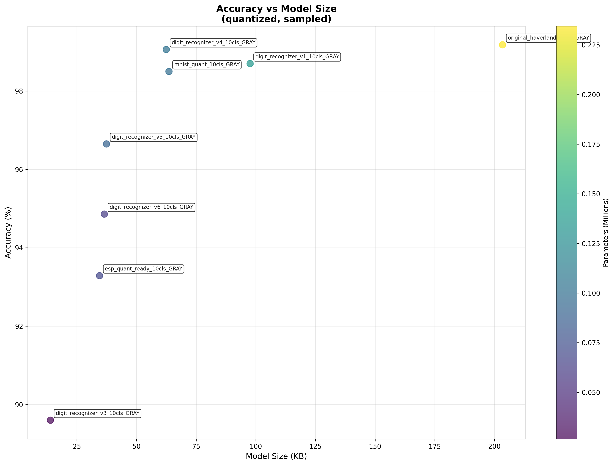

# Digit Recognizer

A deep learning project for rotating digit recognition using various neural network architectures.

## Overview

This project implements and compares different neural network models for recognizing rotating digits from [haverland dataset](https://github.com/haverland/Tenth-of-step-of-a-meter-digit). 

The goal is to explore the trade-offs between model complexity, size, and accuracy.

It's actually focused on 10 classes recognitions [0-9] but can works for 100 classes [0-99] And grayscale as it performs the same on test datasets

Grayscale or RGB runs the same on test datasets, but RGB need more resources at image processing level.

## Model Performance

The graph above shows the relationship between model accuracy and model size across different neural network architectures. As demonstrated, the project explores how different model complexities affect recognition performance.

| Model                          | Parameters | Size_KB | Accuracy | Inferences/sec |
| ------------------------------ | ---------- | ------- | -------- | -------------- |
| original_haverland_10cls_GRAY  | 234500     | 203.4   | 0.9918   | 6040           |
| digit_recognizer_v4_10cls_GRAY | 102400     | 62.5    | 0.9906   | 4466           |
| digit_recognizer_v1_10cls_GRAY | 135700     | 97.6    | 0.987    | 7489           |
| mnist_quant_10cls_GRAY         | 98700      | 63.6    | 0.985    | 6588           |
| digit_recognizer_v5_10cls_GRAY | 90400      | 37.4    | 0.9665   | 3708           |
| digit_recognizer_v6_10cls_GRAY | 61500      | 36.5    | 0.9486   | 7244           |
| esp_quant_ready_10cls_GRAY     | 69200      | 34.5    | 0.9329   | 7689           |
| digit_recognizer_v3_10cls_GRAY | 26500      | 13.9    | 0.896    | 11018          |
|                                |

## Features

- Multiple neural network architectures
- Model size vs accuracy analysis
- Training and evaluation pipelines
- Visualization tools
- Pre-trained models

## Results

The project demonstrates that :

 - Using training [Quantization aware training](https://www.tensorflow.org/model_optimization/guide/quantization/training) can lead to better results
 - tlite-micro or esp-dl compabilities suppress model operators (like relu6)
 - There is major differences between training efficiency and real tests
 - Model size "double" the tensor arena needed in memory
 - CPU operations must be also taken into parameters for IOT
 - RGB or grayscale has very same benchmark results, but the processing is not the same as in parameters needed. It also needs a lot of more cpu and memory to process
 
 ## RGB - Grayscale model comparison : 
 if the modeel use Conv2D (fast all), it flatten all channel, that's why the result are very the same between RGB and grayscale
 
 ##### How Conv2D Actually Works with Channels:
-   **Input**: `(height, width, channels)` - e.g., `(32, 20, 1)` for grayscale or `(32, 20, 3)` for RGB
-   **Conv2D with 32 filters**: Each filter has shape `(3, 3, channels)` and produces 1 output channel
-   **Output**: `(height, width, 32)` - 32 feature maps, each combining information from all input channels

## Related Projects

This work contributes to improved digit recognition research, including the [Tenth-of-step-of-a-meter-digit](https://github.com/haverland/Tenth-of-step-of-a-meter-digit) project for enhanced meter digit analysis.

## Contributing
Contributions are welcome! Please feel free to submit pull requests or open issues for suggestions.

## License
This project is licensed under the Apache-2.0 license

